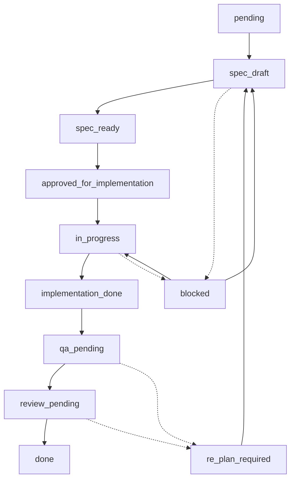

# File: .agent/workflows/sdd_feature_workflow.md
# ──────────────────────────────────────────────────────────────────────
# Propósito: Definir el workflow documental SDD para guiar el ciclo de vida de una feature.
# Rol: Workflow documental y no activo (no ejecutable) del arnés.
# ──────────────────────────────────────────────────────────────────────

# Workflow documental SDD por feature

## Descripción
Workflow documental para guiar el ciclo de desarrollo Spec-Driven Development (SDD) por feature, regulando los estados, artefactos de especificación y criterios de validación humano-agente.

---

## 1. Propósito del workflow
Este workflow establece las directrices lógicas y operativas para guiar el ciclo de vida completo del desarrollo de una característica (*feature*) bajo la metodología Spec-Driven Development (SDD). Su objetivo es asegurar que las transiciones entre fases (desde la idea inicial hasta el cierre definitivo) se ejecuten con trazabilidad, control humano e inspección técnica verificable.

## 2. Estado actual
* **Estado actual:** Documental / No ejecutable / No activo.
* **Límite operativo:** Este archivo actúa únicamente como referencia metodológica y especificación de diseño de procesos. No contiene comandos ejecutables, scripts de automatización agéntica ni archivos de configuración YAML/JSON de arranque activo. Antigravity o cualquier otro agente de IA debe interpretarlo como un documento informativo y abstenerse de automatizar o ejecutar autónomamente sus transiciones de estado.

## 3. Documentos de referencia obligatoria
Antes de realizar cualquier consulta o control de flujo sobre este workflow, se deben revisar y respetar las siguientes fuentes de verdad del repositorio:
- [docs/00_mapa_y_gobernanza_documental.md](../../docs/00_mapa_y_gobernanza_documental.md) (Gobernanza y mapa documental).
- [docs/constitucion_del_proyecto.md](../../docs/constitucion_del_proyecto.md) (Reglas no negociables y límites).
- [docs/01_metodologia_base_comun.md](../../docs/01_metodologia_base_comun.md) (Principios de entregable candidato y LEAN).
- [docs/02_metodologia_desarrollo_software_sdd_harness.md](../../docs/02_metodologia_desarrollo_software_sdd_harness.md) (Ruta del ciclo de software).

## 4. Estados de una feature
Para asegurar el correcto seguimiento del desarrollo, cada característica del sistema debe clasificarse formalmente en uno de los siguientes 11 estados obligatorios:

1. **`pending`:** La feature ha sido identificada y agregada al backlog o repositorio de especificaciones, pero no se ha iniciado ningún trabajo sobre ella.
2. **`spec_draft`:** Se inicia la redacción inicial del borrador de especificaciones (requerimientos y aclaraciones de supuestos).
3. **`spec_ready`:** Los requerimientos funcionales y las aclaraciones están consolidados y estructurados.
4. **`approved_for_implementation`:** El diseño técnico y la lista granular de tareas secuenciales han sido aprobados explícitamente por el humano. El desarrollo está autorizado a comenzar.
5. **`in_progress`:** El agente implementador o desarrollador está programando el código candidato.
6. **`implementation_done`:** La codificación del entregable candidato ha concluido y se encuentra listo para iniciar validaciones locales.
7. **`qa_pending`:** Pendiente de la ejecución y verificación de los planes de pruebas y criterios de QA definidos.
8. **`review_pending`:** Las pruebas automáticas y manuales se han superado con éxito. El entregable candidato queda en espera de la auditoría y revisión humana final.
9. **`done`:** El cambio ha superado todas las validaciones de QA, ha sido verificado en revisión cruzada, y el código se consolida en la rama principal.
10. **`blocked`:** El trabajo de diseño o implementación se encuentra temporalmente detenido debido a impedimentos, dudas sin resolver o dependencias externas no atendidas.
11. **`re_plan_required`:** Alguna validación o prueba técnica crítica ha fallado durante el ciclo. Requiere pausar la programación para diagnosticar el fallo, ajustar las tareas o replanificar el diseño antes de reanudar el trabajo.

## 5. Transición entre estados
Las transiciones de estado de una característica se realizan de forma secuencial y estructurada, como se ilustra a continuación:

* **Gatillos de transición:**
  - `pending` a `spec_draft`: Cuando se crea el directorio `specs/<feature_id>/` y se inicia el borrador.
  - `spec_draft` a `spec_ready`: Tras documentar y resolver las dudas iniciales.
  - `spec_ready` a `approved_for_implementation`: Aprobación explícita del humano sobre el diseño y la lista de tareas.
  - `approved_for_implementation` a `in_progress`: Al comenzar a modificar o crear los archivos de código fuente candidatos.
  - `in_progress` a `implementation_done`: Al declarar que la funcionalidad requerida en el checklist de tareas ha sido programada.
  - `implementation_done` a `qa_pending`: Al iniciar la ejecución del plan de pruebas locales.
  - `qa_pending` a `review_pending`: Al verificar que el 100% de las pruebas automáticas e inspecciones mínimas han pasado correctamente.
  - `review_pending` a `done`: Autorización humana final de cierre y fusión del código definitivo en la rama principal.

## 6. Artefactos esperados por feature
Para que una característica sea válida metodológicamente, debe contar obligatoriamente con los siguientes 6 artefactos de especificación ubicados en la ruta `specs/<feature_id>/`:

1. **`requirements.md`:** Especifica el alcance, los casos de uso, los actores y los criterios de aceptación funcionales de la feature.
2. **`clarifications.md`:** Registra las preguntas realizadas por el agente y las respuestas brindadas por el desarrollador humano para resolver dudas de negocio o supuestos técnicos.
3. **`design.md`:** Detalla la arquitectura de la solución, esquemas de bases de datos, APIs afectadas, diagramas de flujo y estructura limpia del código propuesto.
4. **`tasks.md`:** Lista ordenada de tareas granularizadas, atómicas y numeradas que dividen el trabajo de desarrollo de software.
5. **`validation.md`:** Plan de pruebas técnicas (unitarias, de integración o manuales) diseñado para contrastar la implementación frente a los criterios de aceptación.
6. **`review.md`:** Historial de revisiones de código, auditorías de diseño realizadas por otros agentes o humanos, y feedback para el cierre.

## 7. Criterios de transición (Gates de calidad)

### 7.1. Criterios para pasar de Spec a Implementación
Para realizar la transición del estado `spec_ready` al estado `approved_for_implementation`, el entregable candidato debe cumplir el siguiente gate:
- El archivo `requirements.md` debe estar consolidado y no contener secciones incompletas.
- El archivo `clarifications.md` debe tener todas las dudas críticas resueltas; no se permiten supuestos sin validar.
- El diseño documentado en `design.md` debe respetar la arquitectura preexistente del arnés, evitar dependencias externas redundantes y justificar técnicamente el uso de nuevos paquetes.
- El checklist de `tasks.md` debe estar granularizado y secuenciado de forma lógica.
- **Aprobación obligatoria:** El desarrollador humano debe otorgar el visto bueno explícito al diseño y la planificación antes de iniciar cualquier modificación en el código.

### 7.2. Criterios para pasar de Implementación a QA
Para transitar del estado `implementation_done` al estado `qa_pending`, se deben verificar los siguientes puntos:
- Todas las subtareas definidas en `tasks.md` deben estar marcadas como completadas.
- El código fuente candidato debe estar escrito siguiendo las convenciones y estilos del lenguaje y del proyecto.
- No debe existir código muerto (funciones huérfanas, imports no utilizados) ni trazas de depuración de desarrollo persistentes en el codebase candidato.
- Se debe haber documentado el entorno y el plan detallado para ejecutar las pruebas dentro de `validation.md`.

### 7.3. Criterios para Cierre (`done`)
Para pasar de `review_pending` al estado consolidado `done` de forma definitiva:
- Se debe haber registrado la evidencia ejecutable y reproducible (como diffs de Git o capturas de pantallas/logs para elementos de UI) que acredite que la funcionalidad se comporta exactamente como se esperaba.
- El plan de pruebas definido en `validation.md` debe haberse ejecutado con éxito, sin fallos pendientes de resolución en los casos obligatorios para la feature.
- Se debe realizar una revisión cruzada (por un desarrollador humano o por un agente auditor independiente) para inspeccionar la calidad y limpieza del código candidato.
- **Evidencia en historial:** Debe registrarse la evidencia de cierre correspondiente en los documentos operativos del arnés (`progress/current.md` y `progress/history.md`) cuando estas carpetas queden habilitadas para features específicas.
- **Aprobación final:** El humano aprobador debe aprobar de forma explícita el cierre y la integración final de la característica en el repositorio principal.

## 8. Casos de bloqueo (`blocked`)
Una feature pasará inmediatamente al estado `blocked` si se detecta alguna de las siguientes situaciones:
- **Ambigüedad funcional:** Dudas de negocio o requerimientos contradictorios en `requirements.md` que impidan definir un diseño robusto.
- **Dependencias faltantes:** Necesidad de integrar software o librerías de terceros que no han sido autorizadas o que no se encuentran disponibles.
- **Limitación técnica:** Falta de herramientas de desarrollo o soporte en el entorno local (por ejemplo, ausencia del intérprete de Python, SDKs de pruebas o variables de entorno requeridas).
- **Riesgo crítico:** Identificación de posibles fallos de seguridad o riesgos financieros imprevistos.
- **Acción requerida:** El agente debe detener su actividad operativa, marcar la feature como `blocked` y documentar detalladamente el motivo y la vía propuesta para solucionarlo. No se retomará la feature hasta que se resuelva la causa raíz del bloqueo.

## 9. Regla de replanificación (`re_plan_required`)
Si durante la fase de QA o en la revisión del entregable candidato se detecta un fallo en el funcionamiento, una regresión en el comportamiento general del arnés o una inconsistencia funcional frente a las especificaciones:
- **Prohibido parchar a ciegas:** Se prohíbe realizar modificaciones improvisadas y directas en el código para intentar pasar la prueba por fuerza.
- **Procedimiento de replanificación:**
  1. Cambiar el estado de la feature a `re_plan_required`.
  2. Documentar detalladamente el error o la regresión encontrada en `validation.md` o `review.md`.
  3. Analizar si la falla responde a un defecto en la implementación del diseño (error de código) o a un vacío lógico en las tareas originales.
  4. Si es necesario, actualizar la especificación de diseño (`design.md`) y reestructurar la lista de tareas en `tasks.md` para cubrir la brecha identificada.
  5. Una vez reestructuradas y aprobadas las tareas de ajuste, la feature volverá al estado anterior que corresponda según el alcance del cambio: `spec_draft` si hay que modificar requerimientos o diseño, `approved_for_implementation` si solo cambia la planificación, o `in_progress` si la corrección no altera la spec aprobada.

## 10. Límites del MVP actual
- **Restricción de automatización:** Este workflow describe la lógica de control que deberán seguir los agentes e ingenieros en el futuro, pero durante el MVP actual del arnés, no cuenta con un motor de ejecución automática que controle las transiciones mediante scripts, hooks o herramientas automáticas.
- **Operación manual:** Las transiciones de estado deben ser analizadas y registradas de manera manual y conceptual, enfocándose principalmente en la correcta estructuración documental del repositorio.
