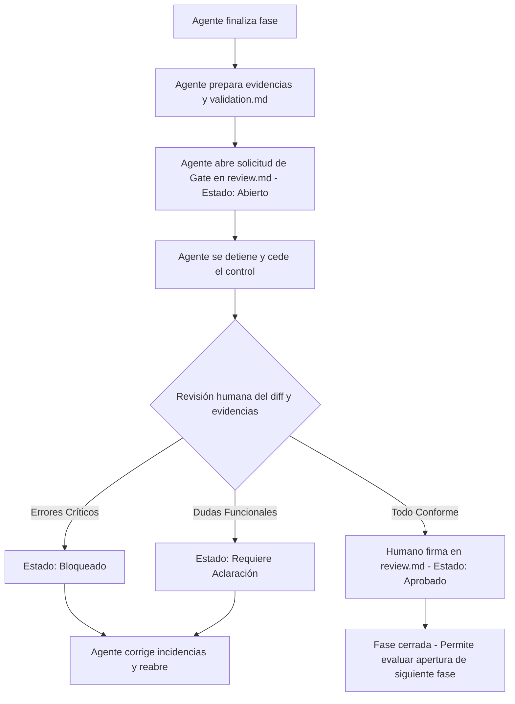

# File: specs/f_013_gate_manual_futuro/design.md
# ──────────────────────────────────────────────────────────────────────
# Propósito: Definir el diseño conceptual, estados y estructura del Gate Manual.
# Rol: Spec de diseño de la feature F-013 en estado candidato.
# ──────────────────────────────────────────────────────────────────────

# Diseño conceptual — F-013: Gate manual futuro

**Versión:** v0.1-candidato  
**Estado:** Candidato (Fase 1 - Spec Piloto Documental)  
**Tipo:** Diseño Conceptual y Flujo Procedimental  
**Ubicación:** `specs/f_013_gate_manual_futuro/design.md`

---

## 1. Propósito del diseño

Este documento define la arquitectura conceptual y procedimental para el funcionamiento del **Gate Manual Futuro (F-013)**. El diseño se basa exclusivamente en convenciones de Markdown y Git, evitando cualquier tipo de lógica ejecutable o dependencias técnicas.

---

## 2. Alcance del diseño

* **Incluido:** 
  * Ciclo de vida y estados del gate.
  * Flujo procedimental paso a paso entre el agente de IA y el desarrollador humano.
  * Estructura estándar en texto plano (Markdown) para el bloque de firma y dictamen.
  * Definición de la ubicación y trazabilidad de las evidencias asociadas.
* **Excluido (Bloqueado):**
  * Scripts de automatización en Python o Bash.
  * Validadores automáticos de commits o diffs.
  * Configuración de hooks de Git.
  * Integración técnica con directivas o workflows en la carpeta `.agent/`.

---

## 3. Flujo conceptual del gate manual

El flujo operativo sigue una estructura estrictamente secuencial y auditable:



---

## 4. Estados del Gate

El gate de transición de fase puede encontrarse en uno de los siguientes estados documentales en `review.md`:

1. **`abierto`:** La fase ha concluido por parte del agente. Las evidencias están listas y enlazadas. Pendiente de la acción del revisor.
2. **`aprobado`:** El revisor ha verificado las evidencias y el cumplimiento procedimental, estampando su firma. Permite al agente proponer la apertura de la siguiente fase o tarea, siempre bajo autorización humana explícita.
3. **`bloqueado`:** Se han detectado fallos arquitectónicos o documentales críticos. El desarrollo está detenido hasta aplicar las correcciones pertinentes.
4. **`requiere_aclaracion`:** Hay aspectos del diseño o del análisis que no quedan claros y necesitan aclaración antes de dictaminar.
5. **`requiere_replanificacion`:** Se detectan desviaciones sustanciales en el alcance o requisitos que obligan a actualizar la planificación previa.

---

## 5. Estructura del bloque de firma manual

Para consolidar la aprobación de manera determinista y auditable, se utilizará el siguiente bloque de firma en formato Markdown dentro del archivo `review.md`:

```markdown
### Bloque de Firma de Transición de Fase
* **Fase / Feature ID:** [e.g., F-013]
* **Fecha de Dictamen:** [YYYY-MM-DD]
* **Commit de Referencia (SHA):** [e.g., e942469]
* **Revisor Principal:** [Nombre del desarrollador humano o Equipo Auditor]
* **Dictamen Oficial:** [APROBADO | BLOQUEADO | REQUIERE_ACLARACION | REQUIERE_REPLANIFICACION]
* **Observaciones y Feedback:** [Espacio para notas breves del revisor]
* **Firma de Aceptación:** [Nombre o firma de texto del humano]
```

---

## 6. Registro de evidencias y trazabilidad

Las evidencias físicas asociadas al gate se registrarán mediante rutas relativas al proyecto, tales como:
* Enlaces a los documentos de especificación: `specs/f_013_gate_manual_futuro/requirements.md`.
* Enlaces al plan de validación ejecutado: `specs/f_013_gate_manual_futuro/validation.md`.
* Referencias a la lista de características generales: `progress/feature_list.md`.

Esto asegura que cualquier auditor procedimental pueda hacer clic en los enlaces y contrastar el estado de manera directa y rápida sin depender de rutas absolutas del sistema operativo del desarrollador (`file:///wsl$/...`).

---

## 7. Qué NO se diseña todavía (Restricciones activas)

> [!WARNING]
> **COMPORTAMIENTO NO EJECUTABLE:**
> No se diseñan ni se permiten mecanismos de parseo automático del bloque de firma mediante scripts. El bloque de firma es un acuerdo procedimental puro y debe tratarse como texto estático. El framework de testing `pytest`, el uso de `uv` y cualquier suite de código ejecutable se mantienen bloqueados y fuera del alcance de este diseño.
